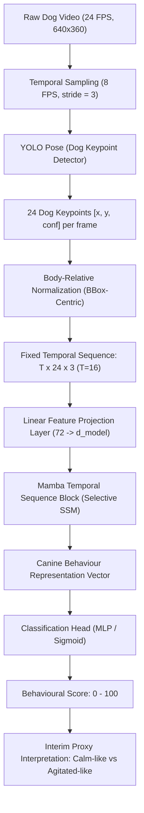

# Video Temporal Pipeline Architecture & Preprocessing Design

**Project:** Zero Rabies-MMNet  
**Stage:** Video Preprocessing & Temporal Sequence Pipeline  
**Date:** 2026-09-23  
**Target Hardware:** NVIDIA GeForce RTX 3050 Laptop GPU (4.0 GB VRAM)  
**Task Scope:** Interim Canine Behavioural Proxy Assessment (CALM vs AGITATED / Score 0–100).  
*Notice: This pipeline operates on behavioural cues and posture/motion proxies. It does NOT claim or measure direct rabies diagnostic probability.*

---

## 1. End-to-End Pipeline Overview

The video temporal pipeline extracts canine anatomical pose dynamics across continuous video footage, normalizes them against camera and positional variation, and models temporal transitions using a selective state-space model (Mamba).

---

## 2. Pipeline Stage Specifications

### Stage 1: Input
- **Raw Dog Video:**
  - Standard CCTV, shelter camera, or phone recording.
  - In Animal Kingdom: 24.0 FPS, $640 \times 360$ resolution, variable durations (0.21s to 16.0s, median 2.52s).
  - Single- or multi-dog scene (primary dog tracked via detection confidence).

### Stage 2: Temporal Sampling
- **Sampling Rate:** 8.0 FPS (selected to balance motion Nyquist rate and 4GB GPU memory footprint).
- **Sampling Mechanism:** Uniform downsampling from 24 FPS video using a stride of $k = 24 / 8 = 3$ (frames $0, 3, 6, 9, \dots$).
- **Nominal Window:** $T = 16$ temporal observations $\approx 2.0$ seconds.
- **Handling Variable Durations:**
  - *Clips $\ge 16$ observations ($\ge 2.0$s):* Initial contiguous 16-frame window extracted (or sliding window with stride during evaluation).
  - *Clips $< 16$ observations ($< 2.0$s):* Padded to $T = 16$ using zero-padding or edge-replication padding (last valid pose replicated), accompanied by a boolean padding mask tensor $M \in \{0, 1\}^{T}$ to mask padded steps in loss computation.

### Stage 3: Dog Pose Detection (Ultralytics YOLO Pose)
- **Model:** YOLO11 / YOLOv8 Pose fine-tuned on Ultralytics Dog-Pose (8,476 images, 24 keypoints).
- **Output per frame:**
  - Bounding box: $[x_{min}, y_{min}, x_{max}, y_{max}]$, confidence $c_{box}$.
  - 24 Anatomical Keypoints:
    1. front_left_paw, 2. front_left_knee, 3. front_left_elbow
    4. rear_left_paw, 5. rear_left_knee, 6. rear_left_elbow
    7. front_right_paw, 8. front_right_knee, 9. front_right_elbow
    10. rear_right_paw, 11. rear_right_knee, 12. rear_right_elbow
    13. tail_start, 14. tail_end
    15. left_ear_base, 16. right_ear_base
    17. nose, 18. chin
    19. left_ear_tip, 20. right_ear_tip
    21. left_eye, 22. right_eye
    23. withers, 24. throat
  - Coordinates in raw image space: $(x_{k,t}, y_{k,t}) \in [0, W] \times [0, H]$ (or normalized $[0, 1]$), with confidence/visibility score $c_{k,t} \in [0, 1]$.

### Stage 4: Body-Relative Normalization
To ensure the representation is invariant to dog distance from camera, video resolution ($640 \times 360$ vs $1920 \times 1080$), and dog location in the frame:

1. **Bounding-Box Reference Center & Scale:**
   For frame $t$, with detected bounding box $[x_{min,t}, y_{min,t}, x_{max,t}, y_{max,t}]$:
   $$\text{width: } W_{box,t} = x_{max,t} - x_{min,t}$$
   $$\text{height: } H_{box,t} = y_{max,t} - y_{min,t}$$
   $$\text{center: } (x_{mid,t}, y_{mid,t}) = \left(x_{min,t} + \frac{W_{box,t}}{2}, \, y_{min,t} + \frac{H_{box,t}}{2}\right)$$
   $$\text{scale factor: } S_t = \max(W_{box,t}, \, H_{box,t})$$

2. **Coordinate Normalization Formula:**
   For each keypoint $k \in \{1, \dots, 24\}$:
   $$x'_{k,t} = \frac{x_{k,t} - x_{mid,t}}{S_t}$$
   $$y'_{k,t} = \frac{y_{k,t} - y_{mid,t}}{S_t}$$
   $$c'_{k,t} = c_{k,t} \quad (\text{confidence preserved intact})$$

3. **Fallback & Robustness:**
   - If a keypoint is undetected ($c_{k,t} = 0$), $(x'_{k,t}, y'_{k,t}) = (0.0, 0.0)$.
   - If no dog bounding box is detected in frame $t$, the last known valid pose from frame $t-1$ is carried forward with a decaying confidence flag.

### Stage 5: Model Input Tensor Representation
- **Tensor Shape:** Fixed size $(B, T, 24, 3)$ where $B$ is batch size, $T = 16$.
- **Flattened Frame Feature:** Flattened across keypoints to $(B, T, 72)$ where $72 = 24 \times 3$.
- **Linear Feature Projection:**
  $$\mathbf{z}_t = \mathbf{W}_{proj} \mathbf{p}_t + \mathbf{b}_{proj}, \quad \mathbf{W}_{proj} \in \mathbb{R}^{d_{model} \times 72}$$
  Projects 72 normalized pose coordinates into embedding space $d_{model} \in \{64, 128\}$.

### Stage 6: Mamba Temporal Modeling Block
- **Selective State-Space Architecture:**
  $$\mathbf{h}_t = \bar{\mathbf{A}} \mathbf{h}_{t-1} + \bar{\mathbf{B}} \mathbf{z}_t$$
  $$\mathbf{y}_t = \mathbf{C} \mathbf{h}_t$$
  where discretization parameters $\Delta, \bar{\mathbf{B}}, \mathbf{C}$ are input-dependent (selective SSM).
- **Advantage on RTX 3050 4GB GPU:**
  - Linear computational complexity $O(T)$ in time and $O(1)$ recurrent memory during step inference.
  - Extremely compact hidden state footprint compared to standard multi-head self-attention transformers ($O(T^2)$ KV-cache).
- **Sequence Aggregation:**
  Temporal pooling (mean pooling over non-padded steps or final hidden state $\mathbf{h}_T$) produces the video behaviour vector $\mathbf{v} \in \mathbb{R}^{d_{model}}$.

### Stage 7: Classification Head & Behavioural Scoring
- **MLP Head:** Two-layer projection with GELU activation and dropout (0.2):
  $$\hat{y}_{logit} = \mathbf{w}_2^\top \text{GELU}(\mathbf{W}_1 \mathbf{v} + \mathbf{b}_1) + b_2$$
- **Probability & Behavioural Score:**
  $$P(\text{AGITATED}) = \sigma(\hat{y}_{logit}) \in [0, 1]$$
  $$\text{Behavioural Score} = \text{round}(P(\text{AGITATED}) \times 100) \in [0, 100]$$
- **Proxy Interpretation:**
  - `0 – 35`: Low Agitation / Calm-like behaviour (e.g. resting, slow walking, yawning).
  - `36 – 65`: Moderate Activity / Transitional movement.
  - `66 – 100`: High Agitation / Vigorous dynamic action (e.g. running, attacking, aggressive chasing).

---

## 3. Clear Distinction of Pipeline Interfaces

| Interface Role | Data Type | Dimensions / Format | Content Description |
|---|---|---|---|
| **INPUT** | Raw Video File | `.mp4` video (24 FPS, $640 \times 360$) | Visual stream containing canine subject |
| **INTERMEDIATE** | Raw Keypoints | Array of shape $(T_{raw}, 24, 3)$ | Unnormalized pixel $(x, y)$ and confidence from YOLO Pose |
| **MODEL INPUT** | Normalized Sequence | Float Tensor $(B, 16, 72)$ + Mask $(B, 16)$ | BBox-centered, scale-normalized, fixed-length temporal tensor |
| **LATENT** | Behaviour Representation | Float Tensor $(B, d_{model})$ | Learned spatio-temporal posture/motion embedding |
| **OUTPUT** | Risk Proxy Score & Class | Integer $(0 - 100)$ + String (`CALM` / `AGITATED`) | Interim behavioural arousal proxy rating |

---

## 4. Hardware Optimization for RTX 3050 (4.0 GB VRAM)

| Parameter | Selected Baseline | Rationale for 4GB VRAM |
|---|---|---|
| Sequence Length ($T$) | 16 observations (2.0 s @ 8 FPS) | Minimal memory footprint ($16 \times 72$ floats/clip); avoids OOM |
| Embedding Dim ($d_{model}$) | 64 or 128 | Keeps projection weights $< 100$ KB; fast forward pass |
| Batch Size ($B$) | 16 (training), 1 (inference) | Fits comfortably within 4GB along with PyTorch runtime overhead |
| Precision | FP16 / AMP (Automatic Mixed Precision) | Halves tensor VRAM requirements; leverages RTX 3050 Tensor Cores |
| Pose Decoupling | Two-stage pipeline (Offline Pose Cache) | Extracting pose features once to `.npz`/disk prevents running heavy YOLO during temporal Mamba training |

---

## 5. Strict Data Partitioning & Leakage Prevention Rules

1. **Animal Kingdom Split:**
   - **47 Train Clips:** Exclusively used for model fitting and optional internal clip-level cross-validation.
   - **21 Held-Out Test Clips:** Preserved strictly for final evaluation; never touched during training.
   - **No Clip Fragment Leakage:** Temporal windows or sliding crops from a clip must never be partitioned across both train and validation/test.
2. **Social Play Split:**
   - Must be partitioned strictly at the **dog / session level** (`participant_id`).
   - Never split windows from the same dog across partitions.
3. **Cross-Dataset Isolation:**
   - Social Play samples must never be mixed into Animal Kingdom's 21 test clips.
